# Привет, я Алексей 👋

Добро пожаловать в мой GitHub профиль! ✨

## 👨‍💻 О себе

Я фронтенд-разработчик, увлеченный созданием креативных и функциональных веб-приложений. Работаю с современными технологиями и стараюсь сделать мир чуть лучше с помощью кода. Люблю изучать новые языки программирования и фреймворки, экспериментировать с дизайном и архитектурой.

## 🛠️ Навыки и технологии

- **Frontend**: HTML, CSS, React, Dart  
- **Backend**: NodeJS  
- **Другое**: Анимации, UI/UX дизайн, адаптивная верстка  

  

## 🌎 Связаться со мной

- 📧 Email: alexeygit@eml.cc
- 🌐 [Мой профиль](https://github.com/Alexey2451)
- 🎨 [Мои работы](https://github.com/Alexey2451?tab=repositories)  

---

_“Код — это искусство, а разработка — это магия!”_
